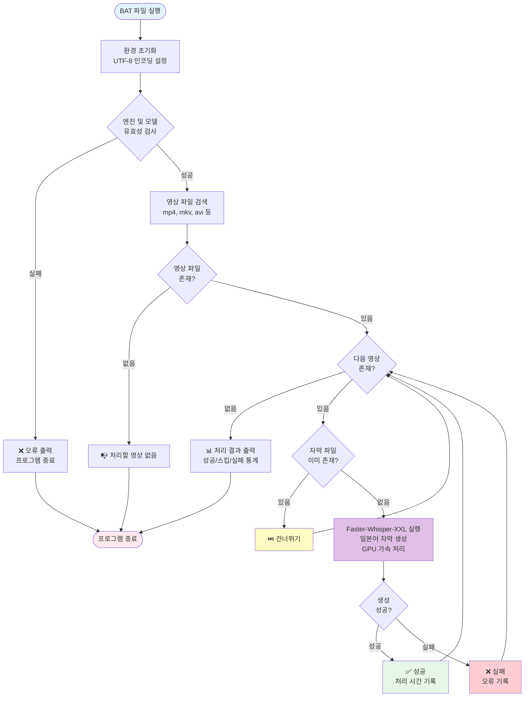

# make_srt

Faster-Whisper-XXL을 활용한 자동 자막 생성 도구

## 📌 개요

팟플레이어에서 영상 재생 시 자막을 편리하게 생성하기 위한 자동화 도구입니다.
Faster-Whisper-XXL 엔진을 사용하여 고품질의 일본어 자막을 생성합니다.

## 🎯 주요 특징

- **자동 일괄 처리**: 폴더 내 모든 영상 파일을 자동으로 처리
- **GPU 가속**: NVIDIA 그래픽 카드를 활용한 빠른 처리 속도
- **고품질 자막**: Faster-Whisper-XXL large-v2 모델 사용
- **중복 방지**: 이미 자막이 존재하는 파일은 자동으로 스킵

## 🔍 모델 선택 과정

### Whisper AI 테스트

비교 테스트 방법

동일한 영상 파일 준비 (1시간, 2시간, 3시간 분량)
각 모델별로 2회씩 일본어 자막 생성
AI를 활용하여 모델별 결과 비교 분석

여러 Whisper AI 모델(v2, v3, v3-turbo)을 비교 테스트한 결과:

| 항목 | v2 | v3 | v3-turbo |
|------|----|----|----------|
| 정확도 | 중간 | 높음 | 중간 |
| 생성 속도 | 중간 | 느림 | 빠름 |
| 환각 현상 | 적음 | 많음 | 적음 |

**결론**: 표준 Whisper AI 모델은 팟플레이어의 Faster-Whisper-XXL 대비 모든 면에서 성능이 떨어져 사용 불가 판정

### Faster-Whisper-XXL 테스트

동일한 조건으로 Faster-Whisper-XXL 모델을 테스트한 결과:

- **v2**: 정확도와 환각 현상의 균형이 가장 우수
- **v3**: 높은 정확도이나 환각 현상이 다소 증가
- **v3-turbo**: 빠른 속도이나 정확도가 v2 대비 낮음

**최종 선택**: large-v2 모델 (정확도와 안정성의 최적 균형)

### 성능

- 2시간 분량 영상 기준: 약 10~15분 소요 (대화량에 따라 변동)
- 팟플레이어 내장 변환 엔진보다 우수한 성능

## 🚀 설치 및 사용법

### 사전 요구사항

- NVIDIA GPU 및 CUDA 설정
- Python 3.8 이상
- Windows 운영체제

### 설치 단계

1. **Faster-Whisper-XXL 다운로드**
   ```
   https://github.com/Purfview/whisper-standalone-win
   ```

2. **프로젝트 파일 구성**
   ```
   your-folder/
   ├── makeSrt_faster_whisper_xxl.py          # Python 스크립트
   ├── [run_make_srt].bat         # 실행 배치 파일
   ├── Faster-Whisper-XXL/ # Whisper 엔진 폴더
   └── models/             # 모델 파일 폴더
       └── large-v2/       # 모델 파일
   ```

3. **배치 파일 경로 설정**
   - `[run_make_srt].bat` 파일을 열어 Python 스크립트 경로 확인

4. **모델 다운로드**
   - Python 스크립트 실행으로 모델 자동 다운로드
   - 다운로드된 모델 위치 확인

5. **모델 경로 설정**
   - `makeSrt_faster_whisper_xxl.py`에서 모델 경로 지정

### 실행 방법

1. 자막을 생성할 영상 파일을 작업 폴더에 배치
2. `[run_make_srt].bat` 파일 실행
3. 자동으로 모든 영상 파일에 대해 자막 생성

### 지원 영상 포맷

- MP4, MKV, AVI, MOV, WMV, FLV 등

## 📊 프로그램 동작 흐름



## ⚠️ 알려진 이슈

- 자막 생성은 정상적으로 완료되나, 프로세스 종료 시 간헐적 오류 발생
- 기능상 문제없으며 추후 수정 예정

## 📝 참고사항

- 처음 실행 시 모델 다운로드로 인해 시간이 소요될 수 있습니다
- GPU 메모리가 부족한 경우 처리 속도가 느려질 수 있습니다

## 🔗 관련 링크

- [Faster-Whisper-XXL GitHub](https://github.com/Purfview/whisper-standalone-win)
- [OpenAI Whisper](https://github.com/openai/whisper)

## 📄 라이선스

이 프로젝트는 개인 용도로 자유롭게 사용 가능합니다.
